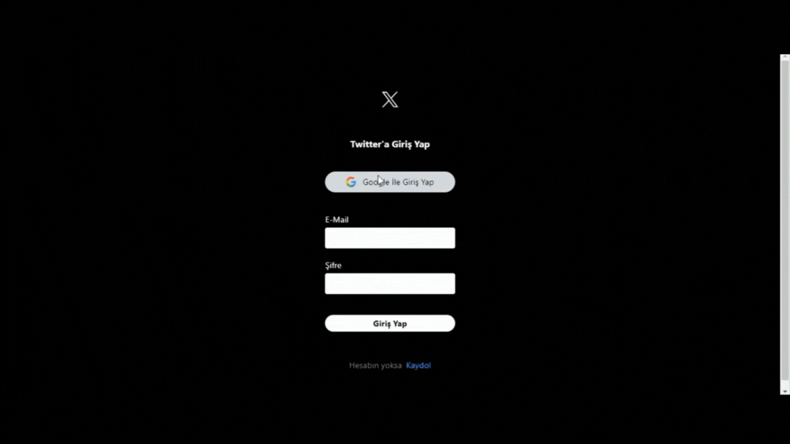

## Twitter Clone Projesi
 Bu proje Firebase kullanılarak oluşturulmuş bir Twitter klonudur. Proje, kullanıcıların tweet göndermesine, tweetleri beğenmesine, tweetleri düzenlemesine ve silmesine olanak tanır.

## Özellikler
- Tweet Gönderme: Kullanıcılar yazı ve/veya fotoğraf içeren tweetler gönderebilir.
- Tweet Beğenme: Kullanıcılar tweetleri beğenebilir.
- Tweet Düzenleme: Kullanıcılar kendi tweetlerini düzenleyebilir.
- Tweet Silme: Kullanıcılar kendi tweetlerini silebilir.

## Kullanılan Teknolojiler
- React: Kullanıcı arayüzünü oluşturmak için kullanıldı.
- Firebase: Backend hizmetleri için kullanıldı (veritabanı, kimlik doğrulama).
- Tailwind CSS: Hızlı ve kolay bir şekilde stil vermek için kullanıldı.
- Moment: Tarih ve saat işlemleri için kullanıldı.
- React DOM: React bileşenlerini DOM'a bağlamak için kullanıldı.
- React Router DOM: React uygulamalarında yönlendirme için kullanıldı.
- React Toastify: Bildirimleri göstermek için kullanıldı.
- UUID: Benzersiz kimlikler oluşturmak için kullanıldı.
- React Icons: Uygulamada ikonları kullanmak için kullanıldı.

## ScreenCast

